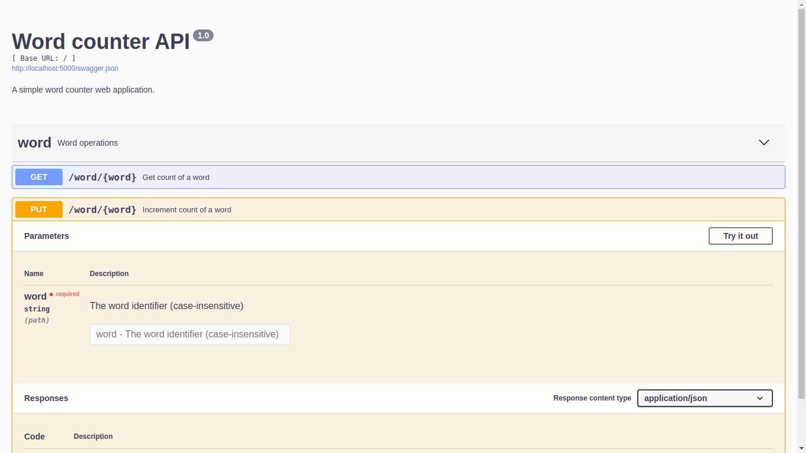

# wordcounter-flask-redis-docker
This is a simple word counter web application running on Docker.The application uses Flask and the counter is maintained with Redis.
Just run through the following simple steps and you will be able to browse the API with a beautiful looking Swagger UI! 

# Screenshot


# Prerequisites
Make sure you have installed both Docker Engine and Docker Compose. You need not install anything else as our docker images will provide for it!

# How to Run
Step 1: Create project directory
```
$ mkdir wordcounter
$ cd wordcounter
```

Step 2: Clone this repo
```
$ git init
$ git clone https://github.com/sahilt75/wordcounter-flask-redis-docker.git
$ cd wordcounter-flask-redis-docker
```

Step 2: Building and running the containers
```sh
$ sudo docker-compose up --build
```

That's it! Verify the deployment by navigating to your server address in your preferred browser.
```sh
localhost:5000
```

# Stop docker
To stop the running service simply type CTRL + C or enter this command
```
sudo docker-compose down
```


